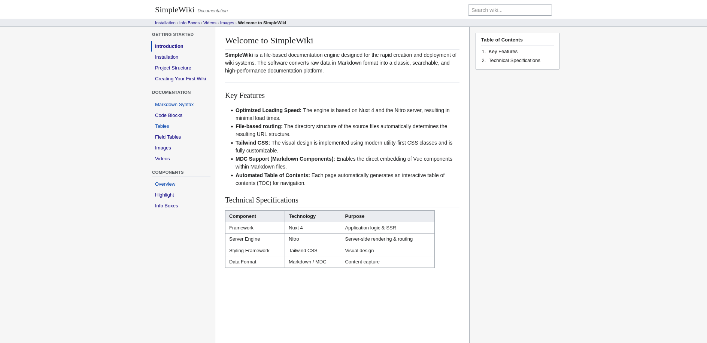

# SimpleWiki

**SimpleWiki** is a file-based documentation engine designed for creating fast and customizable wiki systems.

It transforms Markdown files into a searchable and high-performance documentation platform while keeping the content simple and developer-friendly.

<p align="center">
  
</p>

## 📋 Table of Contents

- [🚀 Quick Start](#-quick-start)
- [✨ Features](#-features)
- [🛠️ Installation](#%EF%B8%8F-installation)
- [🏆 Acknowledgments](#-acknowledgments)
- [📄 License](#-license)
- [📞 Contact](#-contact)

## 🚀 Quick Start

```bash
# Clone the repository
git clone https://github.com/feeeedox/simplewiki.git

# Navigate to project directory
cd simplewiki

# Install dependencies
bun install

# Start the development server
bun dev
```

## ✨ Features

- Fast static site generation
- Markdown and MDC support
- File-based content management
- Automatic navigation generation
- Tailwind CSS powered design
- Custom Vue component support
- Built for documentation and knowledge bases

## 🛠️ Installation

To install SimpleWiki, check out the [installation guide](https://feeeedox.github.io/simplewiki/getting-started/installation) for detailed instructions.

## 🏆 Acknowledgments

### Contributors

<div align="center">

<a href="https://github.com/feeeedox/simplewiki/graphs/contributors">
  
</a>

</div>

### Tools & Libraries Used


### Inspiration

This project was inspired by:
- [MediaWiki](https://www.mediawiki.org/wiki/MediaWiki) - For the design and structure
- [DokuWiki](https://www.dokuwiki.org/) - For the simplicity and file-based approach
- [MkDocs](https://www.mkdocs.org/) - For the static site generation and Markdown support

## 💰 Support the Project

If you like the project, there are several ways you can support it:

### 🌟 Star the Repository
Give the project a star on GitHub!

### ☕ Buy Me a Coffee
[](https://buymeacoffee.com/feeeedox)

### 💝 Sponsor
[](https://github.com/sponsors/feeeedox)

### 🗣️ Spread the Word
- Share on social media
- Write a blog post
- Tell your friends and colleagues

## 🔐 Security

### Reporting Security Vulnerabilities

If you discover a security vulnerability, please send an email to f3dox@proton.me. All security vulnerabilities will be promptly addressed.

## 📄 License

This project is licensed under the MIT License—see the [LICENSE](LICENSE) file for details.

## 📞 Contact

### Project Maintainer

**Florian** - [@feeeedox](https://github.com/feeeedox)

### Get in Touch

<div align="center">

<a href="https://github.com/feeeedox" target="_blank">

</a>
<a href="https://instagram.com/feeeedox" target="_blank">

</a>
<a href="https://codepen.com/Fedox-die-Ente" target="_blank">

</a>
<a href="https://stackoverflow.com/users/16288266" target="_blank">

</a>
<a href="mailto:f3dox@proton.me" target="_blank">

</a>

</div>

### Project Links

- **Documentation**: [feeeedox.github.io/simplewiki/getting-started/installation](https://feeeedox.github.io/simplewiki/getting-started/installation)
- **Demo**: [feeeedox.github.io/simplewiki](https://feeeedox.github.io/simplewiki)
- **Issues**: [GitHub Issues](https://github.com/feeeedox/simplewiki/issues)
- **Discussions**: [GitHub Discussions](https://github.com/feeeedox/simplewiki/discussions)

---

<div align="center">

**[⬆ Back to Top](#-simplewiki)**

Made with ❤️ by [Florian](https://github.com/feeeedox)


</div>

---
