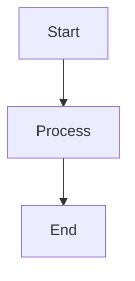
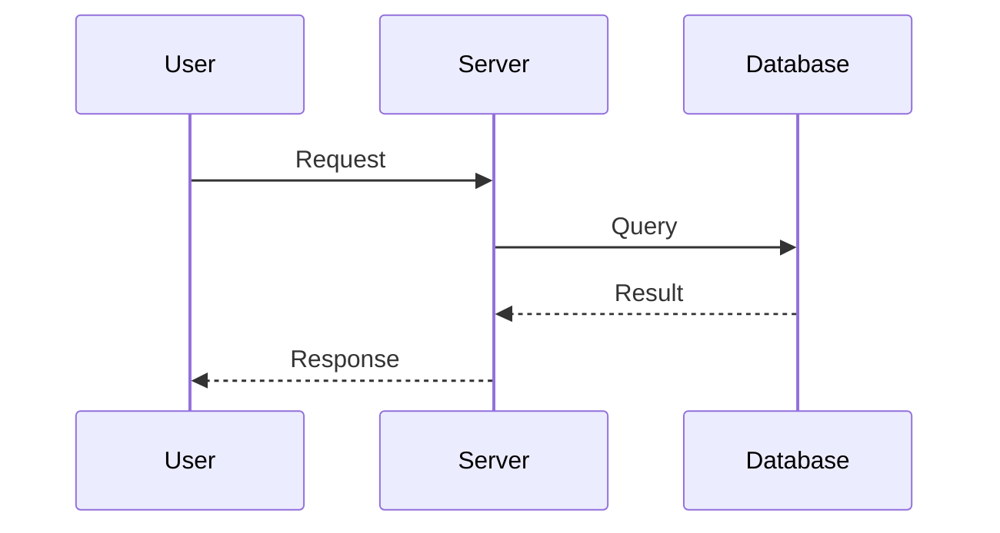

# Mermaid Diagrams

The `mermaid` component allows you to create diagrams using [Mermaid](https://mermaid.js.org/) syntax.

Mermaid supports many different diagram types, including flowcharts, sequence diagrams, class diagrams, state diagrams, and more.

Diagrams are rendered interactively and can be zoomed and moved around.

---

## Basic Usage

Place your Mermaid diagram inside a code block.

````md

````

Result:


---

## Mermaid Syntax

The content inside the component is passed directly to Mermaid.

This means you can use the normal Mermaid syntax for any supported diagram type.

For example, a sequence diagram:

````md

````

Result:


---

## Interactive Controls

Mermaid diagrams can be interacted with directly.

- Scroll to zoom in or out.
- Drag to move the diagram.
- Use the **+** and **−** buttons to change the zoom level.
- Use the **reset** button to reset the view.

This is especially useful for larger diagrams that do not fit completely inside the viewport.

---

## Supported Diagrams

The component supports Mermaid's diagram syntax, so all diagram types supported by the installed Mermaid version can be used.

Examples include:

- Flowcharts
- Sequence diagrams
- Class diagrams
- State diagrams
- Entity relationship diagrams
- Git graphs
- Timelines
- User journeys
- And more

::see-also
---
items:
- title: "Mermaid documentation"
  to: "https://mermaid.js.org/"
  description: "Learn more about Mermaid and its syntax."
---
::

---

## Syntax

The general syntax is:

````md
```mermaid
<mermaid diagram>
```
````