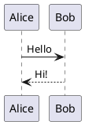
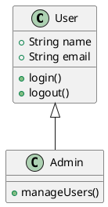

# PlantUML Diagrams

The `plantuml` component allows you to create diagrams using [PlantUML](https://plantuml.com/) syntax.

PlantUML supports many different diagram types, including sequence diagrams, class diagrams, activity diagrams, component diagrams, and more.

Diagrams are rendered directly from the PlantUML source.

---

## Basic Usage

Place your PlantUML diagram inside a `plantuml` code block.

````md

````

Result:


---

## PlantUML Syntax

The content inside the code block is passed directly to PlantUML.

This means you can use the normal PlantUML syntax for any supported diagram type.

For example, a class diagram:

````md

````

Result:


---

## Supported Diagrams

The component supports PlantUML's diagram syntax, so all diagram types supported by the installed PlantUML version can be used.

Examples include:

- Sequence diagrams
- Class diagrams
- Activity diagrams
- Component diagrams
- State diagrams
- Deployment diagrams
- Object diagrams
- Use case diagrams
- Timing diagrams
- And more

::see-also
---
items:
  - title: "PlantUML Documentation"
    to: "https://plantuml.com/"
    description: "Learn more about PlantUML and its syntax."
---
::
---

## Syntax

The general syntax is:

````markdown
```plantuml
@startuml

<plantuml diagram>

@enduml
```
````